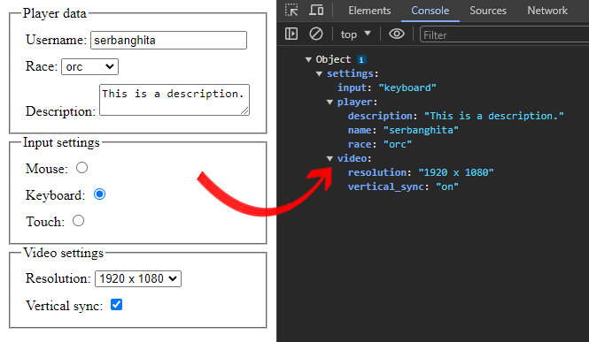

# form-to-object
> Convert **HTML forms** with all their **fields** and **values** to **multidimensional JavaScript** objects


[](https://www.jsdelivr.com/package/npm/form_to_object)

## Install

As a [npm package](https://www.npmjs.com/package/form_to_object):

```shell
npm install form_to_object
```

```js
import formToObject from 'form_to_object';
// or
const formToObject = require('form_to_object');
```

As a JS script:

```html
<!-- Include minified script (~6kb) -->
<script src="build/formToObject.js"></script>

<!-- jsdelivr (CDN) -->
<script src="
https://cdn.jsdelivr.net/npm/form_to_object@3.0.0/build/bundle/formToObject.min.js
"></script>
```

## Example

* Using the DOM node id: `formToObject('myFormId');`
* Using the actual DOM Node reference: `formToObject(document.getElementById('myFormId'));`

Resulted value:

```json
{
  "saveSettings": "Save",
  "name": "Serban",
  "race": "orc",
  "settings": {
     "input": "keyboard",
     "video": {
        "resolution": "1024x768",
        "vsync": "on"
     }
  }
}
```

Good to know:

1. If `<form>` fields are found, but they lack of `name` attribute property, the result will be `{}` (empty object).
2. If `<form>` contains only `disabled` fields, the result will be `{}` (empty object). If you force `includeDisabledFields` then key:value pairs will be returned.
3. An empty `<form>` will throw an Error.
4. In case of an error like non-existing form or invalid selector, an Error will be thrown.

## Options

| Option name                                 | Default                     | Description                                                                                                                          |
|---------------------------------------------|-----------------------------|--------------------------------------------------------------------------------------------------------------------------------------|
| `includeEmptyValuedElements`                | `boolean` (default `false`) | Return field names as keys with empty value `""` instead of just ignoring them.                                                      | 
| `w3cSuccessfulControlsOnly`                 | `boolean` (default `false`) | TBA, WIP                                                                                                                             |
| `selectNameWithEmptyBracketsReturnsArray`   | `boolean` (default `true`)  | `<select>` field names like `name="select[]"` always return an array `[a,b]` instead or array of arrays `[0: [a,b]]`.                |
| `checkBoxNameWithEmptyBracketsReturnsArray` | `boolean` (default `true`)  | `<input>` checkboxes with field names like `name=checkbox[]` always return an array `[a,b]` instead or array of arrays `[0: [a,b]]`. |


## Browser support

IE 8, Firefox 3.5, Chrome, Safari, Opera 10, every mobile browser.

## Example

